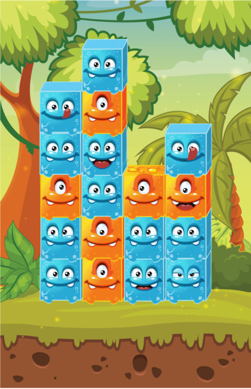
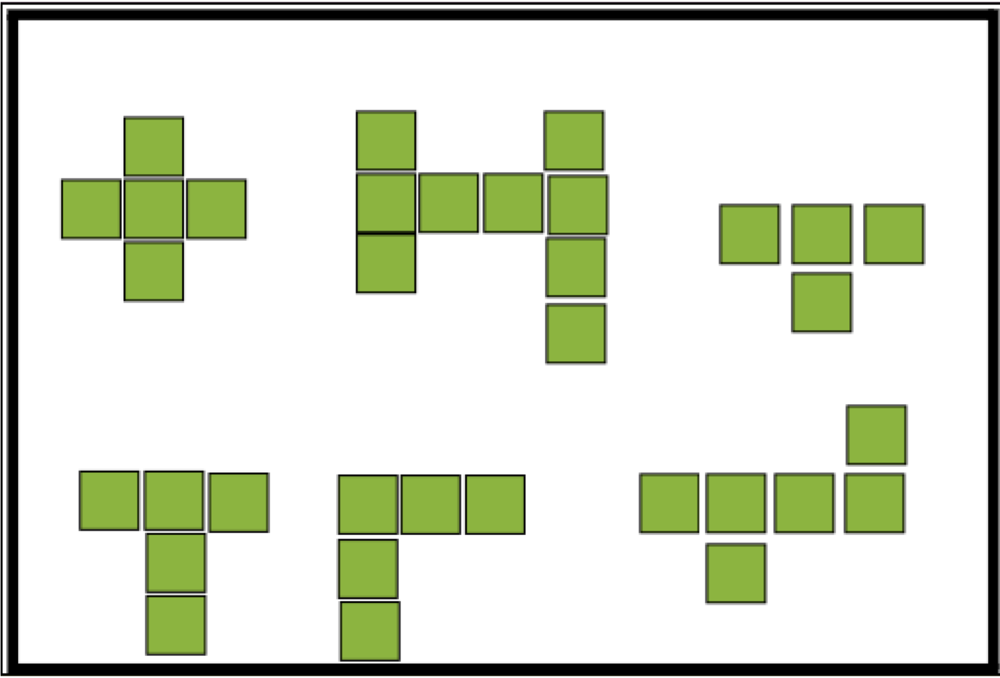

# Match-3 Game (Unity)

A small match-3 game implemented as part of a technical assignment.  
The project was intentionally kept as simple and readable as possible, without using third-party libraries or frameworks.

apk: https://drive.google.com/file/d/1RNBHJLPJ145X72-d8o94KktxChgk8qRa/view?usp=sharing

---

## Game Board

- The board consists of two types of blocks (**Fire** and **Water**).
- The player can move any block one cell per turn in one of four directions: **up, down, left, right**.
- If there is another block in the direction of movement, the two blocks **swap places**.
- If the target cell is empty, the block moves into that cell.
- Moving a block upward is only possible by swapping with the block above — it is **not allowed** to “throw” a block upward into empty space.

---

## Normalization and Movement

- After each move, the board is **normalized**.
- Movement is performed using a **swipe gesture**.
- While normalization is in progress, the player may move blocks that are **not falling or being destroyed**.
- Blocks that are currently falling or marked for destruction **cannot be interacted with**.

---

## Game Objective

- Destroy all blocks using the **minimum number of moves**.
- When all blocks are destroyed (victory), the game automatically transitions to the next level after the final destruction animation completes.
- The number of moves is **unlimited** — the player may make as many moves as desired.

---

## Board Normalization

Normalization consists of two repeating steps and continues as long as further normalization is possible:

1. All “floating” blocks fall downward.
2. If, after a match, a connected area of same-type blocks contains a vertical or horizontal line of **three or more blocks**, the entire connected area is destroyed simultaneously.
3. A connected area consists of blocks of the same type adjacent **vertically or horizontally** (diagonal connections do not count).

The areas shown in the image as examples are valid and must be destroyed entirely.

---

## Save System

Game progress is fully saved between sessions:

- current level
- complete state of the game board

### Save File Location
Application.persistentDataPath/game_save.json

- Save format: **JSON**
- Saving is performed:
  - when the application is minimized
  - when the application is closed
  - after any change to the game board state

---

## Technologies

- **Engine:** Unity 2022.3.62f2 (LTS)
- **Language:** C#
- **Scenes:** 1 (`Main`)

**No third-party plugins are used:**
- DoTween
- UniTask
- Zenject

All logic is implemented using standard Unity features only.

---

## Project Architecture

The project is built with a clear separation of responsibilities:

- **GameManager** — loads configurations and initializes core systems
- **GamePlayController** — manages gameplay flow and scenarios
- **BoardModel** — data model of the game board
- **BoardSystem** — game rules (moves, gravity, matches)
- **BoardVisual** — visual representation of the board
- **BoardController** — gameplay flow (coroutines, action sequencing)
- **UIManager** — UI window management
- **GameStats** — current game state (level, events)
- **SaveSystem** — save/load system

UI and gameplay logic communicate via events, without tight coupling.

---

## Running the Project

1. Open the project in **Unity 2022.3.62f2**
2. Open the `Main` scene
3. Press **Play**

---

## Notes

- The project is focused on simplicity and maintainability
- The architecture is easy to extend (new levels, UI, win conditions)
- The code is written without over-engineering

---